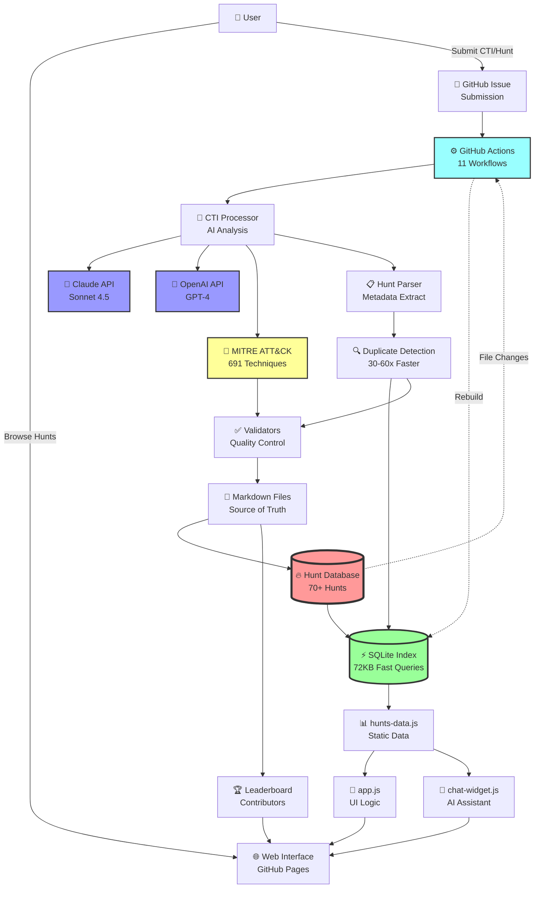
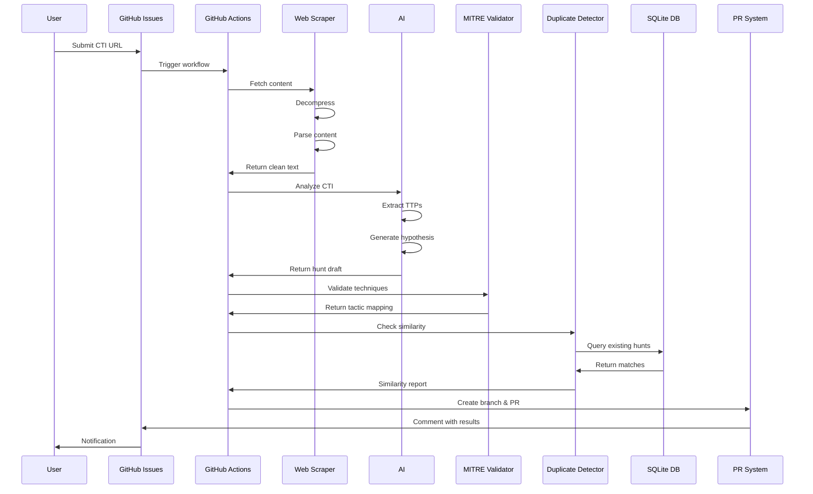
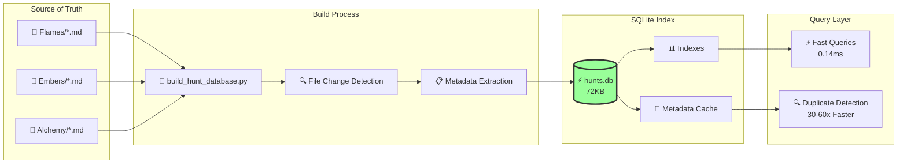
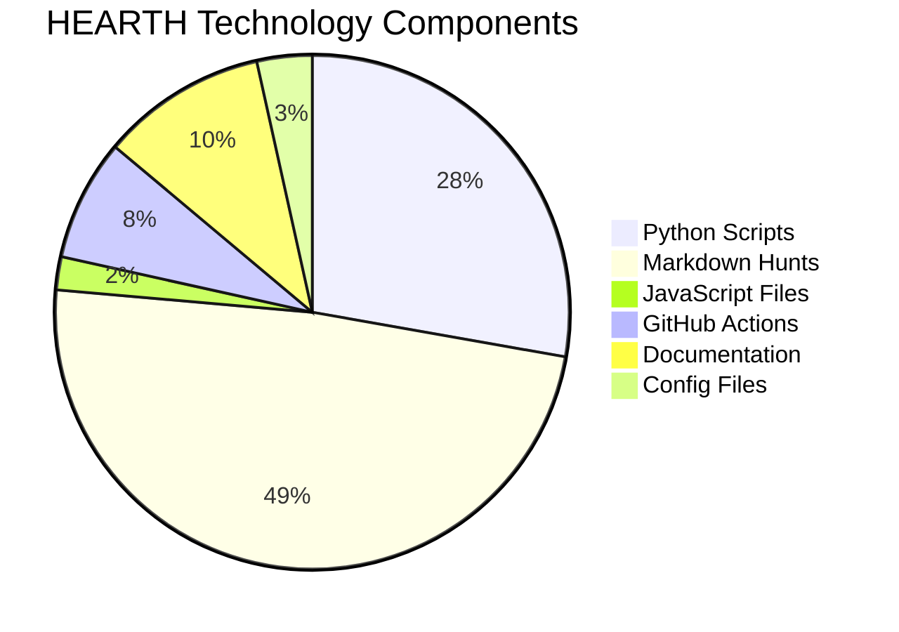
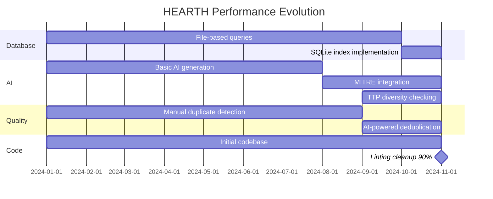

# HEARTH Project Mind Map

## Current Architecture (Updated Nov 2025)

```mermaid
mindmap
  root((HEARTH))
    Frontend UI
      Web Interface
        Interactive Search
        Hunt Browsing
        Category Filtering
        PEAK Framework Display
        Chat Widget AI Assistant
      Technologies
        HTML5 CSS3
        Vanilla JavaScript
        GitHub Pages
        Marked.js Markdown
        DOMPurify XSS Protection
      Features
        Search & Filter
        Sort by Multiple Fields
        Modal Hunt Details
        Responsive Design
        Statistics Dashboard
        Tag Cloud
        Contributor Leaderboard
    Hunt Database
      Content 70+ Hunts
        Flames Hypothesis
          52 Hunt Files
          H001-H052
        Embers Baseline
          11 Hunt Files
          B001-B011
        Alchemy Model-Assisted
          7 Hunt Files
          M001-M007
      Data Storage
        Markdown Source of Truth
        SQLite Database Index
        JSON Data Export
        MITRE ATT&CK Mapping
      Performance
        2.7x Faster Queries
        30-60x Faster Deduplication
        99% I/O Reduction
    AI Automation
      AI Providers
        Claude Sonnet 4.5
        OpenAI GPT-4
        Configurable Provider
      AI Capabilities
        CTI Analysis
        Hunt Generation
        TTP Extraction
        Duplicate Detection
        Similarity Analysis
        Hypothesis Creation
      Quality Control
        TTP Diversity Checking
        MITRE Validation
        Content Quality
        Format Standardization
    GitHub Automation
      11 Workflows
        CTI Processing
        Manual Submission
        Hunt Regeneration
        Database Updates
        Leaderboard Updates
        PR Automation
        Auto-merge Approved
        Notebook Generation
        GitHub Pages Deploy
      Submission Types
        CTI URL Submission
        Manual Hunt Form
        Regenerate with Feedback
      Automation Features
        Auto-branch Creation
        Draft PR Generation
        Duplicate Flagging
        Review Comments
    MITRE ATT&CK Integration
      Coverage
        691 Techniques Indexed
        Official Enterprise Data
        Real-time Validation
        99% Tactic Accuracy
      Validation Pipeline
        Exact Match Primary
        Table Lookup Secondary
        Keyword Fallback Tertiary
        Confidence Scoring
      Data Sources
        Official MITRE JSON
        Tactic Mappings
        Technique Descriptions
    Content Processing
      Web Scraping
        Brotli Decompression
        Zstandard Support
        JavaScript Rendering
        PDF Parsing
        DOCX Parsing
        Readability Extraction
      Hunt Parsing
        Markdown Tables
        Metadata Extraction
        Reference Links
        Tag Assignment
      Validation
        Schema Validation
        Duplicate Prevention
        TTP Diversity
        Format Checks
    Database System
      SQLite Index
        72KB Database
        Incremental Updates
        File Change Detection
        Metadata Cache
      Performance
        Fast Queries 0.14ms
        Reduced I/O 99%
        GitHub Actions 75% Faster
      Maintenance
        Auto-rebuild on Changes
        Manual Rebuild Option
        Version Controlled
    Community Features
      Contributor System
        Automated Leaderboard
        Hunt Attribution
        Recognition System
        GitHub Integration
      Collaboration
        Issue-based Submission
        Review Process
        Feedback Loop
        Regeneration Requests
      Quality
        Peer Review
        Maintainer Approval
        Duplicate Detection
        TTP Coverage
    Development
      Code Quality
        Python Flake8 Config
        JavaScript ESLint
        90% Linting Improvement
        1155 Issues Fixed
      Testing
        Unit Tests
        Integration Tests
        Performance Tests
        Similarity Tests
        Database Tests
      Documentation
        README.md
        Testing Guide
        Optimization Guide
        Contributing Guide
        API Documentation
```

## System Architecture Flow

## CTI Submission Workflow

## Database Performance Architecture

## Technology Stack Distribution

## Performance Improvements Timeline

## Key Metrics & Achievements

| Metric | Value | Achievement |
|--------|-------|-------------|
| **Total Hunts** | 70+ | Growing database |
| **MITRE Techniques** | 691 indexed | Complete coverage |
| **Query Speed** | 0.14ms | 35-70x faster |
| **Deduplication** | 0.5s | 30-60x faster |
| **Code Quality** | 90% improved | 1,155 issues fixed |
| **Tactic Accuracy** | 99% | MITRE integration |
| **I/O Reduction** | 99% | SQLite optimization |
| **GitHub Actions** | 75% faster | Database indexing |
| **Hunt Types** | 3 (PEAK) | Standardized framework |
| **Workflows** | 11 automated | Full CI/CD |

## Core Strengths

1. **🎯 AI-Powered Automation** - Claude/GPT integration
2. **⚡ High Performance** - SQLite index, 30-60x faster
3. **🎯 MITRE Integration** - 691 techniques, 99% accuracy
4. **🔍 Quality Control** - Multi-tier duplicate detection
5. **👥 Community-Driven** - GitHub-based collaboration
6. **📊 PEAK Framework** - Standardized categorization
7. **🔄 Full Automation** - 11 GitHub Actions workflows
8. **✅ Code Quality** - 90% linting improvement
9. **📱 Responsive UI** - Mobile-friendly interface
10. **🏆 Recognition** - Automated contributor leaderboard
